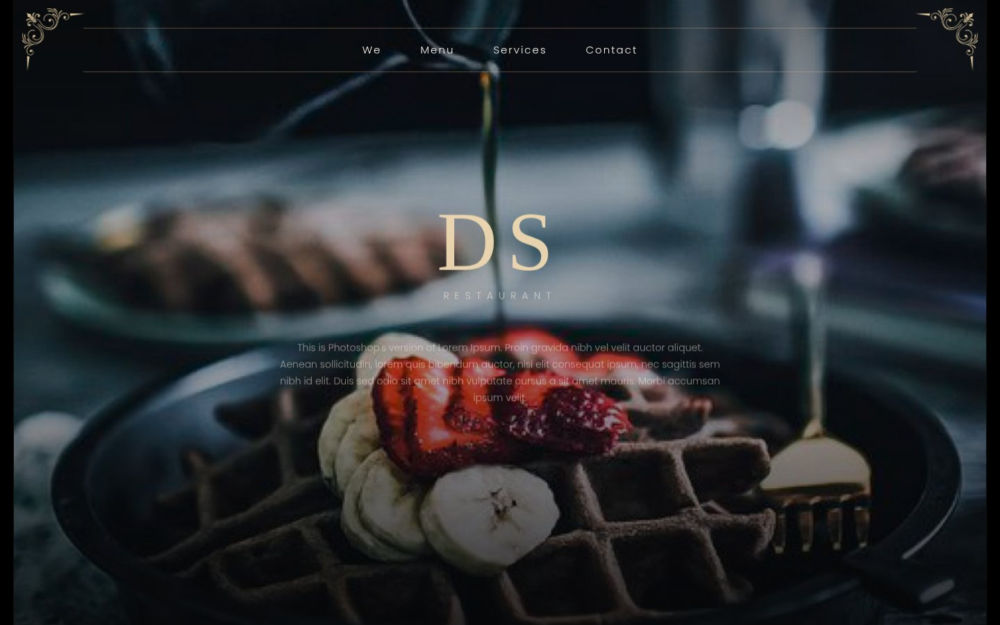

# DS Restaurant — Landing Page

A dark, elegant one-page restaurant landing built from a PSD design mockup (Moody Food, Freepik). Static HTML/CSS/JS, fully responsive, no build step and no dependencies.



## Live demo

Once GitHub Pages is enabled for this repo, the site will be available at:

```
https://lavarenka.github.io/moody-food-landing.io/
```

## Features

- **Fully responsive** — desktop, tablet and mobile layouts, with a collapsible burger menu below 780px.
- **Centered content frame** — the page is capped at 1400px and centered, with a soft drop shadow separating it from the surrounding backdrop on wide screens.
- **Parallax hero** — the header photo subtly zooms and drifts as you scroll.
- **Scroll reveal animations** — sections, images and text fade/slide into view as you scroll down, powered by `IntersectionObserver`.
- **Decorative gold corner ornaments** mirrored via CSS `transform`, no duplicate assets.
- **Sections**: hero, Special Chef Delights, full menu (Starters / Specialties / Drinks), promo blocks (2x1, burgers, discount), delivery service, footer with social links and Freepik attribution.

## Tech stack

- Semantic HTML5
- Vanilla CSS3 (custom properties, CSS Grid/Flexbox, `clamp()` for fluid type)
- Vanilla JavaScript (no frameworks, no build tools)
- Google Fonts: Cormorant Garamond + Poppins

## Project structure

```
.
├── index.html          # markup for all sections
├── style.css           # all styling, responsive breakpoints, animations
├── script.js           # mobile nav, parallax, scroll-reveal, back-to-top
└── assets/
    ├── img/             # section photography (JPG)
    └── icons/           # corner ornaments + social icons (PNG)
```

## Running locally

No build step is required — just serve the folder statically, for example:

```bash
python3 -m http.server 8000
# then open http://localhost:8000
```

or simply open `index.html` directly in a browser.

## Credits

Design mockup ("Moody Food" restaurant template) and stock photography by [Freepik](https://www.freepik.com), used under its free license with attribution (see the site footer).
